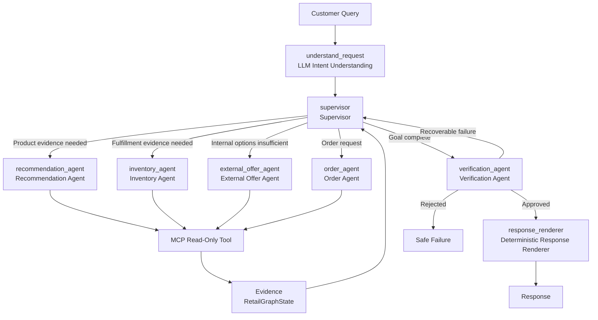

# Scout Agentic Multi-Agent Upgrade Report

## 1. What changed

Scout’s chat/recommendation workflow was upgraded from a mostly fixed agent path into a bounded, variable-length LangGraph supervisor loop with:

- Structured LLM-backed intent extraction with deterministic fallback.
- Expanded shared graph state for intent, evidence, tool history, verification, loop control, and rendering.
- Code-enforced autonomous-safe tool registries for agents. Most tools are read-only; `track_affiliate_click` is a non-commerce analytics action.
- Dynamic Supervisor routing across Recommendation, Inventory, External Offer, Order, Verification, and response rendering nodes.
- Structured claim verification before customer-facing responses.
- Hard execution limits for iterations, tool calls, duplicate calls, verification corrections, and request timeouts.
- Canonical, concise SSE activity events.
- Compatibility preservation for cart, checkout, external offers, order status, product cards, filters, fulfillment map, and existing chat APIs.

## 2. Why it changed

The previous workflow was safe and deterministic, but shopping requests were routed through a more fixed path. The upgrade makes the workflow more agentic while preserving Scout’s safety invariants:

- Agents can cooperate through shared evidence instead of assuming one fixed sequence.
- The Supervisor can choose the next specialist based on missing evidence and limits.
- Customer-facing claims are verified from fresh read-only tool/service reads.
- Mutation workflows remain outside autonomous agent control.
- Failures stop safely instead of looping or inventing missing facts.

## 3. Exact files changed

- `.env.example`
- `scout/agents/response_verification.py`
- `scout/agents/understand_request.py`
- `scout/api/routes/chat.py`
- `scout/api/routes/chat_stream.py`
- `scout/config.py`
- `scout/orchestration/events.py`
- `scout/orchestration/graph.py`
- `scout/orchestration/limits.py`
- `scout/orchestration/routing.py`
- `scout/orchestration/rule_based_policy.py`
- `scout/orchestration/state.py`
- `scout/orchestration/supervisor.py`
- `scout/orchestration/supervisor_decision.py`
- `scout/orchestration/supervisor_policy.py`
- `tests/test_chat_api.py`
- `tests/test_chat_stream.py`
- `tests/test_config.py`
- `tests/test_orchestration_state.py`
- `tests/test_order_chat_api.py`
- `tests/test_response_verification.py`
- `tests/test_retail_graph.py`
- `tests/test_routing.py`
- `tests/test_rule_based_policy.py`
- `tests/test_semantic_recommendation_workflow.py`
- `tests/test_supervisor.py`
- `tests/test_supervisor_policy.py`
- `tests/test_understand_request.py`
- `web/src/components/OrderStatusCard.tsx`

Existing dirty files present in the working tree but not part of the backend agent architecture changes:

- `web/src/App.tsx`
- `web/src/styles.css`

## 4. Exact files created

- `scout/orchestration/tool_registry.py`
- `scout/services/intent_service.py`
- `tests/test_intent_service.py`
- `tests/test_tool_registry.py`
- `AGENTIC_MULTI_AGENT_UPGRADE_REPORT.md`

## 5. How structured intent extraction works

Structured intent extraction lives in `scout/services/intent_service.py` and is called by `scout/agents/understand_request.py`.

Default behavior is intentionally split:

- Intent extraction uses Ollama when available and falls back deterministically.
- Supervisor routing uses Ollama by default (`SUPERVISOR_POLICY=ollama`) and falls back deterministically to the rule-based policy if the model is unavailable or returns an unusable decision.

The extraction flow is:

1. Preserve the original user query in graph state.
2. Build a strict JSON-only prompt for the existing Ollama chat model.
3. Call Ollama with `format: "json"`, `stream: false`, and configured low temperature between `0.0` and `0.2`.
4. Validate the result with the `StructuredIntent` Pydantic schema.
5. Retry once if JSON parsing or validation fails.
6. Fall back to existing deterministic/rule-based extraction if Ollama fails twice or is unavailable.
7. Record extraction source as `llm`, `retry`, or `deterministic_fallback`.

The schema captures:

- `request_type`
- `product_type`
- `category`
- `use_case`
- `attributes`
- `budget_min`
- `budget_max`
- `location`
- `fulfillment_preference`
- `urgency`
- `reference_product_id`
- `comparison_product_ids`
- `order_id`
- `needs_clarification`
- `clarification_question`
- `confidence`

Intent extraction does not decide inventory, promotion, price, store, order ownership, payment, tracking, or eligibility facts.

## 6. How the shared state works

The central LangGraph state is `RetailGraphState` in `scout/orchestration/state.py`.

It preserves legacy fields while adding new agentic fields:

- Session/query: `session_id`, `original_user_query`, `customer_query`
- Intent/goal: `structured_intent`, `intent`, `customer_goal`, `goal`
- Routing: `current_agent`, `next_agent`, `concise_decision_reason`
- Evidence: `candidate_products`, `selected_products`, `fulfillment_options`, `external_offers`, `order_evidence`, `evidence`
- Tooling: `tool_history`, `tool_results`, `tool_call_count`, `repeated_call_counts`
- Verification/rendering: `proposed_claims`, `verification_result`, `final_response`
- Loop control: `iteration_count`, `correction_count`, `stop_reason`, `workflow_started_at`, `workflow_status`, `errors`

The state stores short decision summaries only. It does not store hidden chain-of-thought.

## 7. How the Supervisor selects agents

The Supervisor node is in `scout/orchestration/supervisor.py`; rule-based routing policy is in `scout/orchestration/rule_based_policy.py`.

The Supervisor inspects:

- Structured intent and legacy intent compatibility fields.
- Current customer goal.
- Existing product, fulfillment, external offer, and order evidence.
- Previous tool results.
- Verification failures.
- Iteration/tool/correction limits.

It may select:

- `recommendation_agent`
- `inventory_agent`
- `external_offer_agent`
- `order_agent`
- `verification_agent`
- `clarification`
- `finish`
- `safe_failure`

The Supervisor does not call MCP tools, repositories, SQLite, checkout, payment, order mutation, or inventory mutation.

## 8. How the new variable-length loop differs from the old workflow

Old workflow:

- More fixed, pipeline-like shopping flow.
- Shopping requests tended to move through a common recommendation/inventory/verification sequence.
- External fallback and order routing were less dynamically integrated into one supervisor loop.

New workflow:

- Starts with intent understanding, then Supervisor.
- Each specialist performs one bounded useful action and returns control to the Supervisor.
- The Supervisor decides the next specialist based on missing evidence.
- Order requests can route directly to Order Agent.
- Product search without pickup may skip unnecessary inventory/external fallback.
- Pickup requests can use Recommendation and Inventory Agents cooperatively.
- External Offer Agent runs only after internal options are insufficient.
- Verification can request at most one correction pass.

Implemented graph shape:



## 9. Tool allowlists by agent

Defined in `scout/orchestration/tool_registry.py`.

Recommendation Agent:

- `semantic_search_products`
- `search_products`
- `get_product_details`
- `get_promotions`
- `rank_products`
- `find_similar_products`

Inventory Agent:

- `find_store_by_location`
- `check_store_inventory`
- `find_nearby_inventory`
- `check_network_inventory`
- `get_pickup_estimate`
- `get_delivery_estimate`
- `find_available_substitutes`

External Offer Agent:

- `search_external_offers`
- `get_external_offer_details`
- `track_affiliate_click`

`track_affiliate_click` is not a pure read-only lookup: it records non-commerce affiliate analytics and returns a redirect URL. It cannot add items to the Scout cart, create checkout, create an order, reserve inventory, or start payment.

Order Agent:

- `lookup_order`
- `lookup_latest_order`
- `get_order_status`
- `get_payment_status`
- `get_fulfillment_details`
- `check_order_eligibility`

## 10. Restricted tools

Autonomous agents explicitly cannot call:

- `create_checkout`
- `create_checkout_review`
- `create_payment_intent`
- `confirm_payment`
- `confirm_checkout`
- `create_order`
- `reserve_inventory`
- `update_inventory`
- `cancel_order`
- `issue_refund`
- `process_return`
- `process_exchange`
- `update_order`
- `update_shipping_address`
- `execute_sql`
- `run_sql`
- `generic_sql_execution`
- `execute_repository`
- `generic_repository_execution`
- `execute_mcp`
- `generic_mcp_execution`
- `shell`
- `shell_execution`
- `run_shell`
- `http_request`
- `unrestricted_http_execution`

## 11. Tool preconditions

Implemented deterministic preconditions include:

- Nearby inventory requires location coordinates, a selected store, or a resolved location.
- Pickup estimate requires a valid store and verified pickup stock.
- Substitutes require a product or product requirements.
- External search requires evidence that internal options are insufficient.
- Order lookup requires session and order identifier.
- Comparison/ranking through the registry requires at least two product IDs.

Failed validation returns structured tool rejection, not a tool call.

## 12. Verification gate

`scout/agents/response_verification.py` verifies structured proposed claims before customer-facing response rendering.

It verifies customer-facing claims for:

- Product identity, name, type, category, and price.
- Budget compliance.
- Active promotion.
- Store identity.
- Inventory quantity.
- Pickup availability.
- Delivery availability and configured delivery window.
- External-offer labels and merchant feed fields.
- Order ownership.
- Order status.
- Payment status.
- Tracking status.
- Eligibility claims.

The verifier returns:

- `verified`
- `approved_claims`
- `rejected_claims`
- `missing_evidence`

Rejected claims never reach `final_response`. Recoverable missing evidence can route back through the Supervisor once. A second verification failure safe-fails.

## 13. Checkout safety boundary

Checkout and payment remain outside the autonomous graph.

The deterministic checkout flow remains:

```text
React checkout action
→ FastAPI checkout endpoint
→ validation
→ payment workflow
→ order service
→ inventory reservation
→ database transaction
```

Boundary files:

- React checkout client: `web/src/api/checkoutClient.ts`
- Checkout TypeScript types: `web/src/types/checkout.ts`
- FastAPI checkout routes: `scout/api/routes/checkout.py`
- Checkout service: `scout/services/checkout_service.py`
- Checkout repository transaction: `scout/repositories/checkout_repository.py`

The graph does not import checkout routes, checkout service, checkout tools, checkout repository, or payment mutation tools.

## 14. Execution limits

Configured in `scout/config.py`:

- `max_agent_iterations = 8`
- `max_tool_calls = 10`
- `max_correction_attempts = 1`
- `max_identical_tool_call_count = 1`
- `scout_workflow_timeout_seconds = 20.0`
- `scout_stream_heartbeat_seconds = 15.0`

Enforced by:

- `scout/orchestration/limits.py`
- `scout/orchestration/supervisor.py`
- `scout/orchestration/graph.py`
- HTTP timeout handling in `scout/api/routes/chat.py`
- SSE timeout handling in `scout/api/routes/chat_stream.py`

When limits are reached, Scout stops safely and either verifies usable evidence or returns the fixed safe-failure message.

## 15. SSE events

The SSE implementation is preserved and now emits concise canonical activity labels:

- `Understanding request`
- `Recommendation Agent searching products`
- `Inventory Agent checking selected store`
- `Inventory Agent checking nearby stores`
- `External Offer Agent searching alternatives`
- `Order Agent retrieving order evidence`
- `Verifying claims`
- `Preparing response`
- `Completed`
- `Stopped safely`

SSE does not expose chain-of-thought, prompts, full state, raw MCP payloads, SQL, sensitive order data, or duplicate activity labels.

## 16. Example agent trajectories

Product search with selected-store stock:

```text
understand_request
→ supervisor
→ recommendation_agent
→ supervisor
→ inventory_agent
→ supervisor
→ verification_agent
→ response_renderer
```

Pickup request where selected store is unavailable:

```text
understand_request
→ supervisor
→ recommendation_agent
→ supervisor
→ inventory_agent/check selected store
→ supervisor
→ inventory_agent/check nearby stores
→ supervisor
→ verification_agent
→ response_renderer
```

Internal options exhausted:

```text
understand_request
→ supervisor
→ recommendation_agent
→ supervisor
→ inventory_agent selected/nearby/network/substitutes
→ supervisor
→ external_offer_agent
→ supervisor
→ verification_agent
→ response_renderer
```

Order status:

```text
understand_request
→ supervisor
→ order_agent
→ supervisor
→ response_renderer
```

Verification correction:

```text
verification_agent rejects all candidates
→ supervisor/recommendation correction pass
→ verification_agent
→ response_renderer or safe failure
```

## 17. Test commands

Backend:

```bash
python -m pytest -q
.venv/bin/python -m pytest -q
```

Frontend:

```bash
cd web
npm test
npm run build
```

## 18. Exact test results

Last recorded results:

- `python -m pytest -q` from repo root failed because `/Users/r.dangol/anaconda3/bin/python` does not have `pytest` installed:
  - `/Users/r.dangol/anaconda3/bin/python: No module named pytest`
- `.venv/bin/python -m pytest -q` from repo root:
  - `601 passed, 2 warnings in 9.71s`
- `npm test` from `web`:
  - first sandboxed attempt failed with Vite temp-file `EPERM`
  - approved rerun succeeded: `68 passed`
- `npm run build` from `web`:
  - succeeded
  - Vite output included `✓ built in 706ms`

## 19. Current limitations

- The default Supervisor policy is Ollama-backed (`SUPERVISOR_POLICY=ollama`) with deterministic rule-based fallback.
- Ollama intent extraction requires a locally running Ollama server for live LLM extraction; tests use fake clients and deterministic fallback.
- Supervisor decision source is recorded as `ollama`, `retry`, or `rule_based_fallback`.
- External offers are synthetic/demo data and cannot be added to the Scout cart.
- Delivery estimates are configured prototype estimates, not live carrier commitments.
- Checkout uses a mock payment provider.
- Cancellation, refund, return, and exchange are read-only eligibility checks in the agent graph; execution of those actions is not exposed to autonomous agents.
- The full graph is bounded conservatively; complex recovery paths may return partial/safe-failure responses rather than running indefinitely.

## 20. Local run instructions

Backend setup/run:

```bash
cd /Users/r.dangol/scout-retail-ai-agent
.venv/bin/python -m pytest -q
.venv/bin/uvicorn scout.api.app:create_app --factory --reload
```

Frontend setup/run:

```bash
cd /Users/r.dangol/scout-retail-ai-agent/web
npm test
npm run build
npm run dev
```

Optional Ollama-backed intent/supervisor:

```bash
ollama serve
ollama pull llama3.2
```

Then configure:

```bash
SUPERVISOR_POLICY=ollama
OLLAMA_CHAT_MODEL=llama3.2
OLLAMA_CHAT_TEMPERATURE=0.1
```

## Final summary

### 1. Architecture summary

Scout now uses structured intent extraction, a richer shared state, dynamic Supervisor routing, autonomous-safe specialist agents, structured verification, deterministic rendering, and bounded execution while keeping checkout/payment mutations outside the autonomous graph. Intent extraction uses Ollama when available with deterministic fallback; Supervisor routing is Ollama-backed by default and records `ollama`, `retry`, or `rule_based_fallback`.

### 2. Exact created files

- `scout/orchestration/tool_registry.py`
- `scout/services/intent_service.py`
- `tests/test_intent_service.py`
- `tests/test_tool_registry.py`
- `AGENTIC_MULTI_AGENT_UPGRADE_REPORT.md`

### 3. Exact modified files

- `.env.example`
- `scout/agents/response_verification.py`
- `scout/agents/understand_request.py`
- `scout/api/routes/chat.py`
- `scout/api/routes/chat_stream.py`
- `scout/config.py`
- `scout/orchestration/events.py`
- `scout/orchestration/graph.py`
- `scout/orchestration/limits.py`
- `scout/orchestration/routing.py`
- `scout/orchestration/rule_based_policy.py`
- `scout/orchestration/state.py`
- `scout/orchestration/supervisor.py`
- `scout/orchestration/supervisor_decision.py`
- `scout/orchestration/supervisor_policy.py`
- `tests/test_chat_api.py`
- `tests/test_chat_stream.py`
- `tests/test_config.py`
- `tests/test_orchestration_state.py`
- `tests/test_order_chat_api.py`
- `tests/test_response_verification.py`
- `tests/test_retail_graph.py`
- `tests/test_routing.py`
- `tests/test_rule_based_policy.py`
- `tests/test_semantic_recommendation_workflow.py`
- `tests/test_supervisor.py`
- `tests/test_supervisor_policy.py`
- `tests/test_understand_request.py`
- `web/src/components/OrderStatusCard.tsx`

### 4. Old versus new workflow

Old: mostly fixed shopping sequence.

New: bounded cyclic Supervisor loop where specialists perform one useful action, return evidence to shared state, and the Supervisor chooses the next valid action.

### 5. Tool allowlists

See section 9.

### 6. Restricted tools

See section 10.

### 7. Tests run

- `python -m pytest -q`
- `.venv/bin/python -m pytest -q`
- `npm test`
- `npm run build`

### 8. Exact test results

See section 18.

### 9. Remaining limitations

See section 19.

### 10. Backend and frontend run commands

See section 20.
