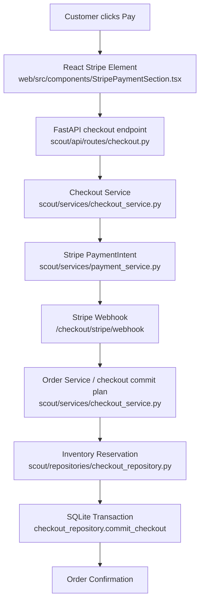

# Scout Stripe Test Payment Integration

## 1. What changed
- Added a payment-provider abstraction with the existing mock provider and a Stripe test-mode PaymentIntent provider.
- Added backend Stripe PaymentIntent creation behind the existing checkout review flow.
- Added a signed Stripe webhook endpoint that finalizes payment state and creates orders through the existing deterministic checkout transaction.
- Added optional React Stripe Elements UI behind `VITE_STRIPE_TEST_CHECKOUT=true`.
- Preserved the existing mock checkout flow as the default.

## 2. Exact files created
- `web/src/components/StripePaymentSection.tsx`
- `STRIPE_TEST_PAYMENT_INTEGRATION.md`

## 3. Exact files modified
- `.env.example`
- `requirements.txt`
- `scout/config.py`
- `scout/database/initialize.py`
- `scout/database/schema.sql`
- `scout/repositories/models.py`
- `scout/repositories/checkout_repository.py`
- `scout/services/payment_service.py`
- `scout/services/checkout_service.py`
- `scout/api/schemas/checkout.py`
- `scout/api/routes/checkout.py`
- `tests/test_config.py`
- `tests/test_checkout_service.py`
- `tests/test_checkout_api.py`
- `web/package.json`
- `web/package-lock.json`
- `web/src/api/config.ts`
- `web/src/api/checkoutClient.ts`
- `web/src/hooks/useCheckout.ts`
- `web/src/types/checkout.ts`
- `web/src/components/CheckoutPanel.tsx`
- `web/src/components/CheckoutPanel.test.tsx`

## 4. Stripe test setup
Backend `.env`:

```bash
PAYMENT_PROVIDER=stripe_test
STRIPE_SECRET_KEY=sk_test_...
STRIPE_PUBLISHABLE_KEY=pk_test_...
STRIPE_WEBHOOK_SECRET=whsec_...
STRIPE_CURRENCY=USD
```

Frontend `.env` in `web/`:

```bash
VITE_STRIPE_TEST_CHECKOUT=true
```

The backend rejects Stripe live keys: secret keys must start with `sk_test_`, and publishable keys must start with `pk_test_`.

## 5. Environment variables added
- `PAYMENT_PROVIDER=mock | stripe_test`
- `STRIPE_SECRET_KEY`
- `STRIPE_PUBLISHABLE_KEY`
- `STRIPE_WEBHOOK_SECRET`
- `STRIPE_CURRENCY`
- `VITE_STRIPE_TEST_CHECKOUT=true` for the optional frontend Stripe UI

## 6. Checkout flow


## 7. Webhook flow
- `POST /checkout/stripe/webhook` verifies Stripe signatures through `StripeTestPaymentProvider.verify_webhook`.
- `payment_intent.processing`, `payment_intent.payment_failed`, and `payment_intent.canceled` update checkout payment state.
- `payment_intent.succeeded` verifies checkout ID, session ID, amount, currency, and PaymentIntent ID before order creation.
- Duplicate webhook events are stored in `stripe_webhook_events` and return idempotently.
- Orders are only created after webhook-confirmed payment success.

## 8. Idempotency strategy
- PaymentIntent creation uses a frontend-generated idempotency key scoped to checkout/session/cart version semantics.
- The PaymentIntent ID is stored on `checkout_sessions`; client secrets are never stored.
- Webhook event IDs are stored in `stripe_webhook_events`.
- Order creation still uses the existing `checkout_repository.commit_checkout` transaction and unique checkout/order/payment constraints.

## 9. Payment safety boundary
- Autonomous agents cannot call checkout, payment, order creation, inventory reservation, refund, cancellation, generic Stripe execution, generic MCP execution, shell execution, or unrestricted HTTP execution.
- Stripe functions are not registered in autonomous tool registries.
- The only Stripe path is explicit customer checkout UI → FastAPI checkout endpoint → Stripe → verified webhook → deterministic SQLite transaction.

## 10. Test card examples
- Success: `4242 4242 4242 4242`
- Authentication required: `4000 0025 0000 3155`
- Decline: `4000 0000 0000 9995`

Use any future expiry date, any CVC, and any postal code in Stripe test mode.

## 11. Test commands and exact results
- Backend: `.venv/bin/python -m pytest -q`
  - Result: `615 passed, 2 warnings in 9.51s`
- Frontend tests: `npm test`
  - Result: `15 passed test files, 68 passed tests`
- Frontend build: `npm run build`
  - Result: build succeeded; `121 modules transformed`

## 12. Current limitations
- Stripe mode is test-only.
- Refunds, cancellation, returns, and exchanges are intentionally not implemented.
- The frontend does not show final order confirmation until webhook processing has created the order; customers may need to refresh/poll payment status in local test setups.
- Existing production SQLite databases must run `initialize_database` to add new checkout payment columns.
- `npm install` reported existing dependency audit findings: 5 vulnerabilities.

## 13. Backend and frontend run commands
Backend:

```bash
.venv/bin/uvicorn scout.api.app:create_app --factory --reload
```

Frontend:

```bash
cd web
npm run dev
```
